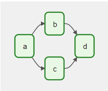
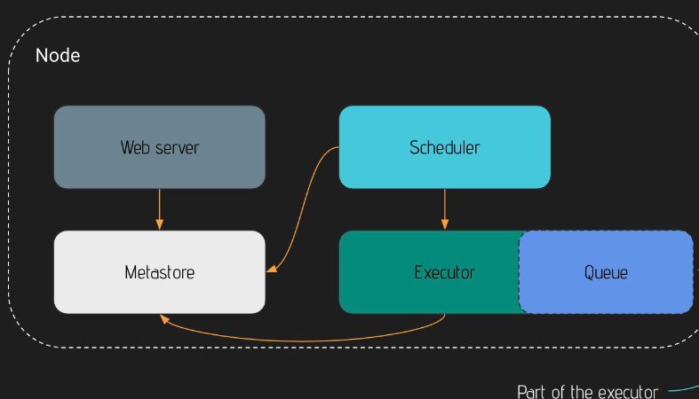
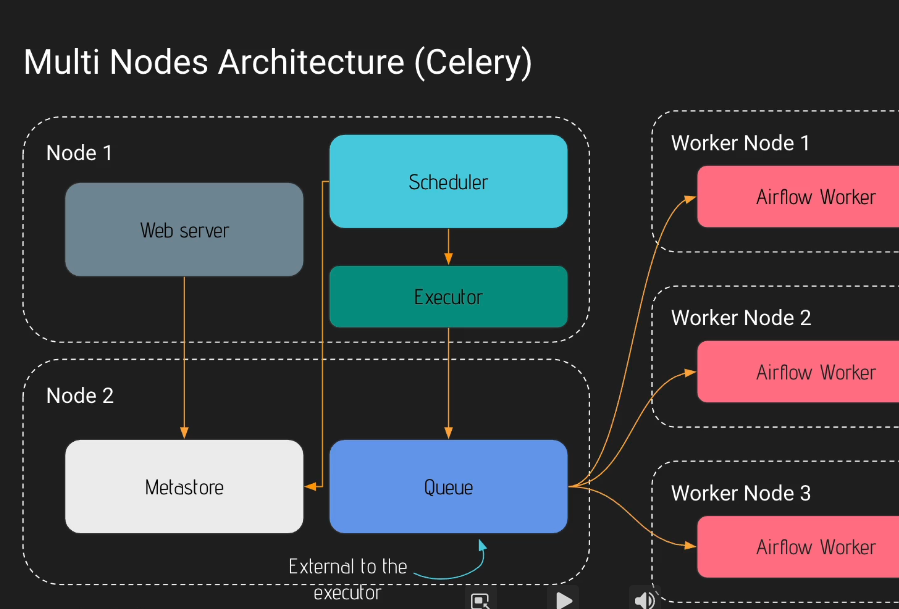

# The Basics of Apache Airflow

## What's Apache Airflow ?
---

Apache Airflow is an open-source platform for programmatically develop, schedule, and monitore batch-oriented workflows. So, it is the best `orchestration` to run task in the right way, in the right order at the right time. Also, it is an extensive python framework allowing to connecting with virtually any technology. These are the benefits:

- `Dynamic` - Pipelines are configured as Python code, allowing for dynamic pipeline generation
- `Extensible` - The airflow framework contains operator to connect with numerous technologies
- `Flexible` - Workflow parameterization is built-in leveraging the [Jinja](https://jinja.palletsprojects.com/en/3.1.x/) templating engine.

## AirFlow Core Components
---

These are the airflow's core components:

- `Web Server` - Flask server with Gunicorn serving the UI
- `Scheduler` - Daemon in charge of scheduling workflows
- `Metastore` - Database where metadata are stored
- `Executor` - Class defining `how` your tasks should be executed, `in which` system the task will be executed(KubernetesExecutor, ServerExecutor).
- `Worker` - Process/subprocess `executing` your task.

## Core Concepts
---

- `DAG` (Direct Acyclic Graph) - Core concept of airflow, collecting Tasks together, organized with dependencies and relationships `without a loop` (No cycles or loop is permitted)
    
    

- `Operator` - An object encapsulating a task that you want to executed, so it is conceptually a template for a predefined Task, that can be declared inside your DAG. There are three different types of operators:
    - `Action Operators` - Operators that execute something (BashOperator, PythonOperator, EmailOperator)
    - `Transfer Operators` - Allows to transfer data to a destination (MySqlOperator, PostgresOperator)
    - `Sensor Operators` - Allows you to wait something to happen in order to move forward (FileSensor, SQLSensor)

- `Task Instance` - It is an instance of the operator in the TAG, basic unit of execution
- `Workflow` - Combination of all the core concepts, DAGs, Operators and dependencies

## What Airflow is not ?
---

Airflow is not a data streaming solution neither a data processing framework (Do not process thousand of Gigabytes of data in your DAG)

Airflow is a way to trigger external tools!

## How Airflow works?
---

There are two ways of deploy Airflow

- `One Node Architecture`



- `Multi Node Architecture`



> All communication is performed metastore, which is used by the webserver in order to display data, and by the scheduled in order to know which tasks to perform and when

> When in a multicluster cenario, the queue components uses redis or rabbitMQ to know the order to execute the tasks

## Running Airflow
---

- Docker (Standalone)

```bash
docker run --rm -p 8080:8080 apache/airflow:latest standalone
```

- Docker Compose (Celeny)

1. Install [Docker Compose](https://docs.docker.com/compose/install/linux/#install-using-the-repository) at least version 1.29

2. Run the following Commands:
```bash
# Fetch DockerCompose configuration
curl -LfO 'https://airflow.apache.org/docs/apache-airflow/2.5.0/docker-compose.yaml'

# Create necessary folders
mkdir -p ./dags ./logs ./plugins

# Get Current User ID and set as environment variable
echo -e "AIRFLOW_UID=$(id -u)" > .env

# Init Database
docker compose up airflow-init

# Running Airflow
docker compose up
```

3. Access the localhost:8080 and enjoy Airflow

## Running CLI Commands
---

In order to execute airflow CLI commands there are three alternatives

1. Docker
```bash
# docker exec -it <container-id> /bin/bash
docker exec -it 4cc17695beba /bin/bash
airflow info
```

2. Docker Compose
```bash
# docker-compose run <container-name> airflow info
docker-compose run airflow-worker airflow info
```

3. Linux (It will use docker-compose)
```bash
curl -LfO 'https://airflow.apache.org/docs/apache-airflow/2.5.0/airflow.sh' 
chmod +x airflow.sh
./airflow.sh info
```


## Including Providers on Docker Image
---

In order to add new providers on airflow perform these steps:

1. Create a new Docker image (based on the desired version) and include the required extra

```Dockerfile
FROM apache/airflow:slim-2.5.0-python3.9
RUN pip install --no-cache-dir "apache-airflow[crypto,celery,postgres,cncf.kubernetes,docker]"==2.5.0
```

2. Build the Image
```bash
docker build -t airflow-ext .
```

3. Check the providers
```bash
docker run --rm -p 8080:8080 airflow-ext providers list
```

4. Run the Airflow
```bash
docker run --rm -p 8080:8080 airflow-ext standalone
```