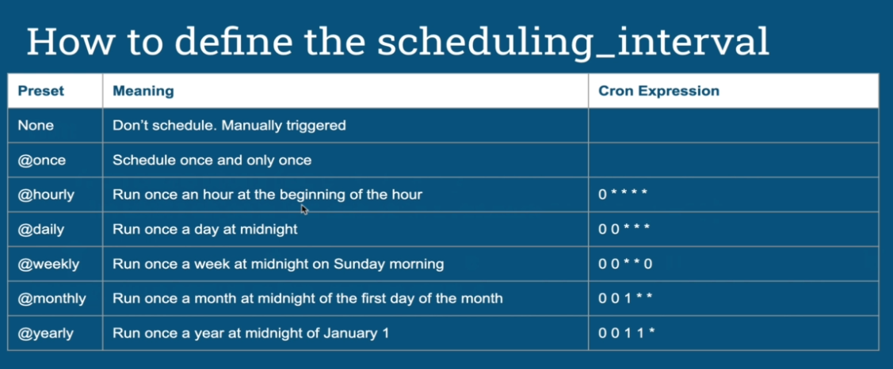

# DAG
 DAG stands up to Direct Acycle Graph and it represents the data pipeline

 ```python
from airflow import DAG
from datetime import datetime, timedelta

DEFAULT_ARGS = {
    "owner" : "airflow",
    "email_on_failure" : False,
    "email_on_retry" : False,
    "email" : "admin@localhost.com.br",
    "retries" : 3,
    "retry_delay" : timedelta(minutes=1),
}

with DAG(
    dag_id="forex_data_pipeline",
    schedule=datetime(2023, 1, 1),
    schedule_interval="@daily",
    default_args=DEFAULT_ARGS,
    catchup=False
) as dag:
    # some tasks (operators) here! 
 ```

 ## Relationship Between Operators
 ---

 In order to setup dependencies between Tasks in your DAG it is utilized the operator `>>`(mother of) and `<<` (children of)

 ```python
    with DAG(
        dag_id="forex_data_pipeline",
        schedule=datetime(2023, 1, 1),
        schedule_interval="@daily",
        default_args=DEFAULT_ARGS,
        catchup=False
    ) as dag:

    forex_processing = SparkSubmitOperator(
        task_id="forex_processing",
        conn_id="spark_conn",
        application="/opt/airflow/dags/scripts/forex_processing.py",
        verbose=False
    )

    send_email_notification = EmailOperator(
        task_id="send_email_notification",
        to="t.missao@gmail.com",
        subject="forex_data_pipeline",
        html_content="<h3>forex_data_pipeline</h3>"
    )

    send_slack_notification = SlackWebhookOperator(
        task_id='send_slack_notification',
        http_conn_id='slack_conn',
        message=_get_message(),
        channel="#monitoring"
    )

    forex_processing >> send_email_notification # same as forex_processing.set_dowstream(send_email_notification)
    send_email_notification >> send_slack_notification
 ```

 ## Most Important Parameters
 ---

 Here is the most important parameters of a DAG

 - `start_date` - The date from which tasks of your DAG can be scheduled and triggered
 - `schedule` - The interval of time from the min(start_date) at which your DAG should be triggered. You can use a cron expressing (0 * * * *) or a timedelta to define it

 > The DAG starts being scheduled from the `start_date` and will be triggered after every `schedule`

 

 - `end_date` - The date your DAG will stop being scheduled (Default None)
 - `catchup` - Perform scheduler catchup (Run the dags not executed during the period of the dag start date and current date)
 - `max_active_runs` - Max number of active DAG runs that can run in parallel

 ## Folder Structure
 ---

Currently there are two methods of organize DAGs projects

1. `Zip File` - Create a zip file packing the DAGs and its unpacked extra file (If module dependencies needed, use `virtualenv and pip`)

2. `DagBag` - Collection of DAGs, parsed out of a folder tree and has a high-level configuration settings. This approach has some drawbacks:
    - Errors are not displayed from the UI (But can be seen on the web server logs)
    - Can not use the command "airflow list_dags"

    In order to create a DagBag it is necessary to create a python script under the dag directory to include these new dags path. An example of script could be found [here](./artifacts/resources/02-MasteringDags/dags/add_dagbags.py).

> Best Practices: Alowas put a .airflowignore file in the DAGs folder in order to avoid wasting resource while scanning for DAGs. (Scan looks for DAG or airflow in files)

## Handling Errors
---
On DAG level airflow provides 4 parameters to monitore and detect errors

- `dagrun_timeout` - specify how long a DagRun should be up before timing out / failing, so that new DagRuns can be created. 
- `sla_miss_callback` - specify a function to call when reporting SLA timeouts.
- `on_failure_callback` - A function to be called when a DagRun of this dag fails.
- `on_success_callback` - Much like the on_failure_callback except that it is executed when the dag succeeds.

## Testing Dags

Mainly there are five categories to test your DAG:

1. DAG Validation Tests - 
    - Check if Valid
    - Check if there is no cycles
    - Check default Arguments
2. DAG/Pipeline Definition Tests
    - Check total number of tasks
    - Check the nature of tasks
    - Check the upstream and downstream dependencies of tasks
3. Unit Tests
    - Check logic of external functions or custom operators
4. Integration Tests
    - Check if tasks can exchange data
    - Check the input of tasks
    - Check dependencies between multiple tasks
5. End to End Pipeline Tests
    - Check if the output is correct
    - Check the full logic
    - Check performances

 ## References
 ---

 - [`DAG Model`](https://airflow.apache.org/docs/apache-airflow/stable/_api/airflow/models/dag/index.html#airflow.models.dag.DAG)