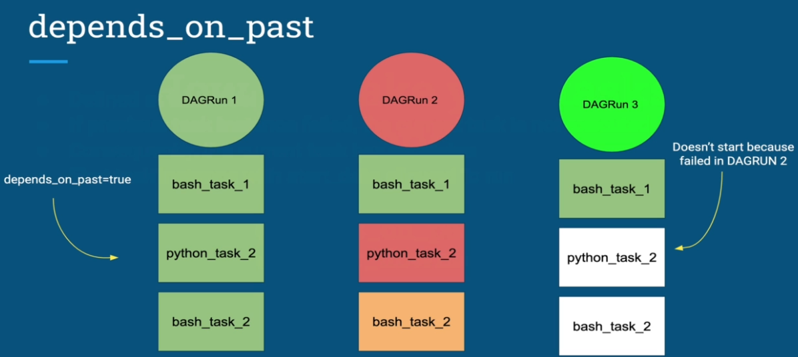
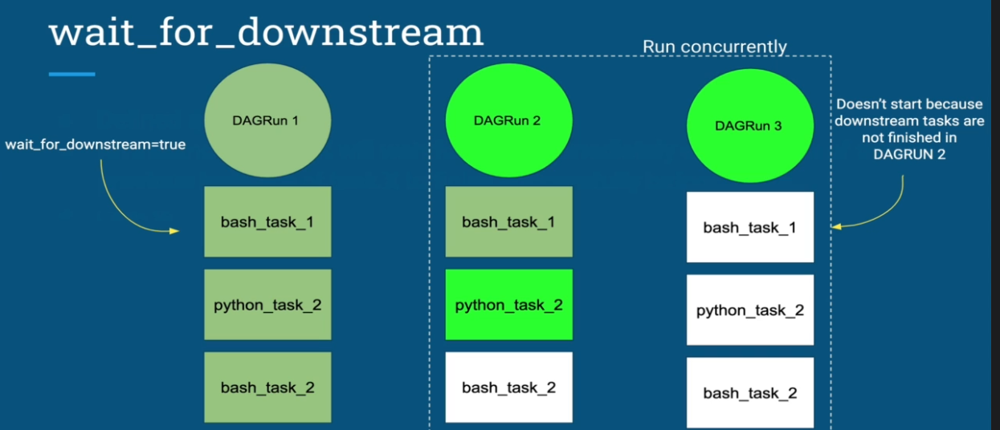

# Operators
---

On Airflow all operators inheritances from the meta class [BaseOperatorMeta](https://airflow.apache.org/docs/apache-airflow/stable/_api/airflow/models/baseoperator/index.html#airflow.models.baseoperator.BaseOperatorMeta) and all [default_args](https://airflow.apache.org/docs/apache-airflow/stable/_api/airflow/models/baseoperator/index.html#airflow.models.baseoperator.BaseOperatorMeta) passed to DAG instance creations are sent to operators

## Type of Operators
---
Currently there are 3 types of operators in Airflow

1. `Action` - Performs Actions
2. `Transfer` - Transfers data from a source to a destination
3. `Sensor` - Awaits a conditions in order to fire up

 ## Most Important Parameters
 ---
  Here is the most important parameters of an Operator

  - `depends_on_past` - When set to true, task instances will run only if the previous instance has succeded or has been skipped

    

  - `wait_for_downstream` - when set to true, an instance of task X will wait for tasks immediately downstream of the previous instance of task X to finish successfully or be skipped before it runs. This is useful if the different instances of a task X alter the same asset, and this asset is used by tasks downstream of task X

  - `queue` - which queue to target when running this job.

    

## Handling Errors
---
On Task level airflow provides 4 parameters to monitore and detect errors

- `email` - the ‘to’ email address(es) used in email alerts. This can be a single email or multiple ones. 
- `email_on_failure` -  Indicates whether email alerts should be sent when a task failed
- `email_on_retry` - Indicates whether email alerts should be sent when a task is retried
- `retries` - the number of retries that should be performed before failing the task
- `retry_delay` - delay between retries, can be set as timedelta or float seconds, which will be converted into timedelta, the default is timedelta(seconds=300).
- `retry_exponential_backoff` - allow progressively longer waits between retries by using exponential backoff algorithm on retry delay 
- `max_retry_delay` - maximum delay interval between retries, can be set as timedelta or float seconds, which will be converted into timedelta
- `execution_timeout` -  max time allowed for the execution of this task instance, if it goes beyond it will raise and fail.
- `on_failure_callback` - a function to be called when a task instance of this task fails. a context dictionary is passed as a single parameter to this function.
- `on_success_callback` - much like the on_failure_callback except that it is executed when the task succeeds.
- `on_retry_callback` -  much like the on_failure_callback except that it is executed when retries occur.

## Reference
---

- [`AirFlow Core Operators`](https://airflow.apache.org/docs/apache-airflow/stable/operators-and-hooks-ref.html)
