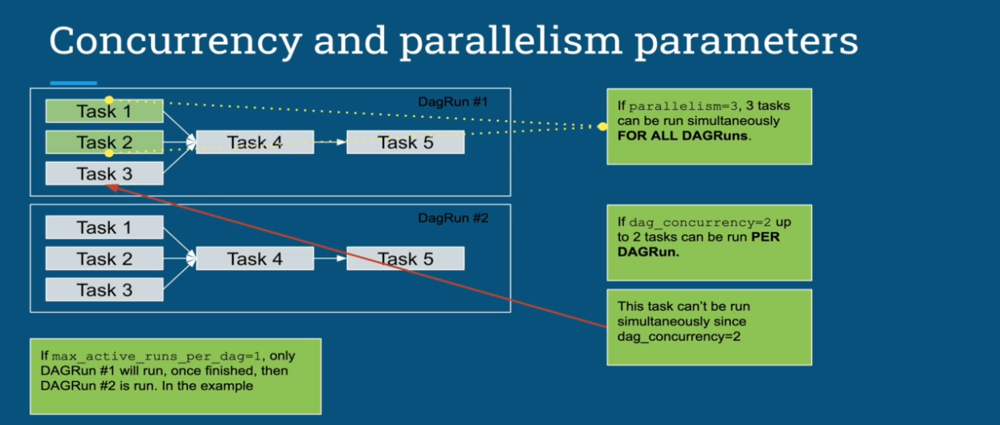
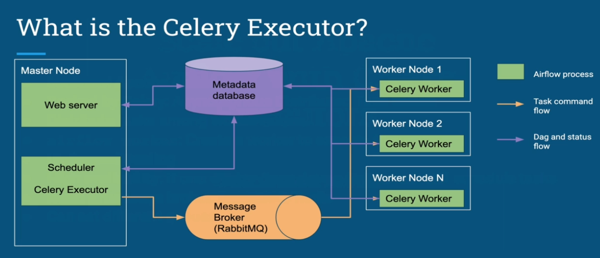
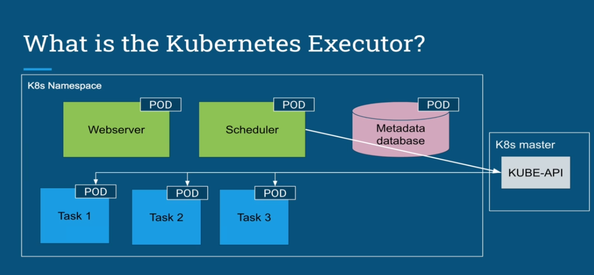

# Executor

Executors are the mechanism by which task instances get run. And they configured in the `airflow.cfg` under the `[core]` section
```
[core]
executor = KubernetesExecutor
```

> Airflow can only have one executor configured at a time

## How a task gets executed?
---

1. When a DAG is scheduled, each task has a record with its status stored into the metadata database.
2. The Scheduler periodically reads from the metadata database to check if there is any task to run.
3. The Executor gets the tasks to run from its internal queue and specify how to execute it (Sequential, Local, Celery, K8s etc)

## Executor Types
---

- `Sequential Executor` - Should not be used in production, only for debugging purposes in the context of Airflow
  - Most Basic executor
  - Only runs one task at a time
  - Only executor to use with SQLite
  - Default Configuration
  ```config
  executor=SequentialExecutor
  sql_alchemy_conn=sqlite:///home/airflow/airflow/airflow.db
  ```

- `Local Executor` - runs tasks by spawning processes in a controlled fashion in different modes.
  - Run multiple tasks in parallel
  - Spawn processes to execute tasks
  - Easy to set up
  - Vertical scalling
  - Single Point of Failure
  - Needs a relational database (MySQL, Postgres, MariaDB)
  > The local executor can run in two models: `Unlimited parallelism` (parallelism == 0) which every task will spawn a process, and `Limited Parallelism` (parallelism > 0) the number of process will be restricted by the number of allowed parallelism and the task will be queued in a queue

  

- `Celery Executor` - Run tasks in a distributed way, allowing horizontal scalling and becoming fault tolerant
  - Scale out Apache Airflow
  - Backed by Celery (Asynchronous Distributed Task Queue)
  - Distribute tasks among worker nodes
  - Horizontal Scalling
  - High Availability: If one worker goes down, Airflow can still schedule tasks
  - Need a message broker (RabbitMQ/Redis)
  - Can set different Queues

  

  > When using Celery Executor it is possible send workloads to specific workers. For example, suppose that a task requires spark, so just a worker with spark installed can handle this task, so it is necessary to instructed this worker to listen from a specific queue using the command `airflow celery worker -q [queue-name]` (airflow celery worker -q spark,quark)

- `Kubernetes Executor` - Runs tasks in a distributed way in Kubernetes
  - Task-level pod configuration
  - Expands and shrinks your cluster according to the workload
  - Pods run to completion
  - Scheduler subscribes to kubernetes event stream
  - DAG Distribution - (Git clone with init-container / Mount volume with DAGs / Build image with DAG codes)

  
