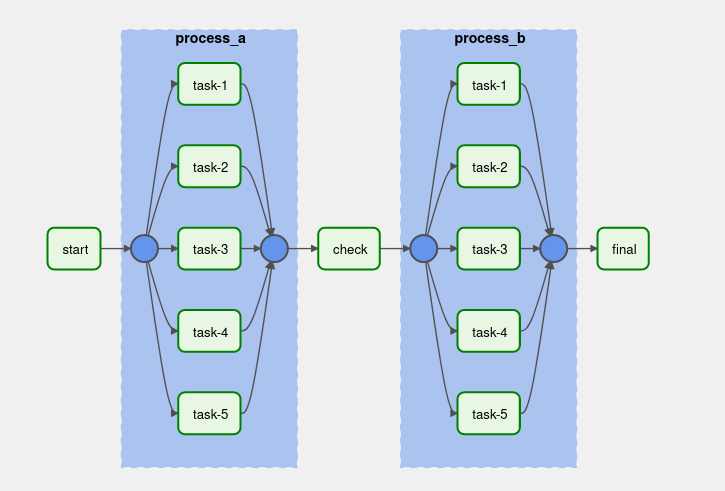
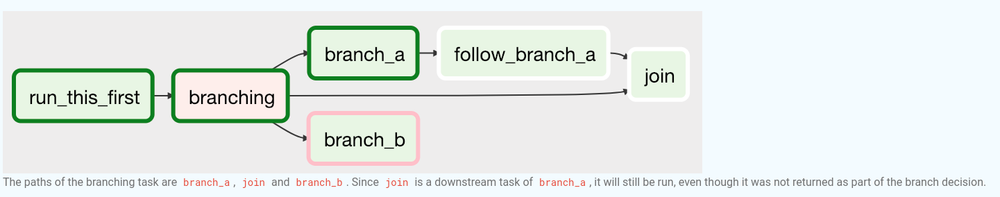
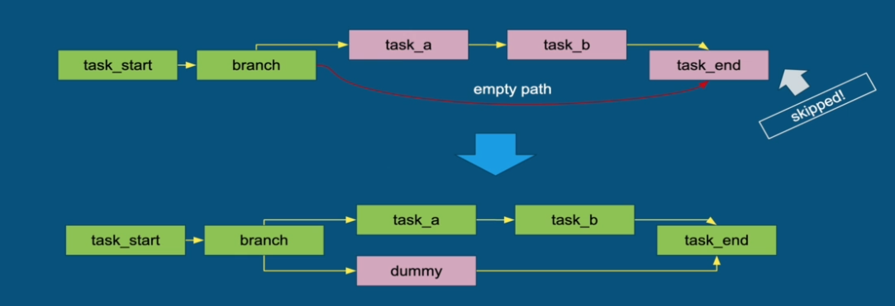
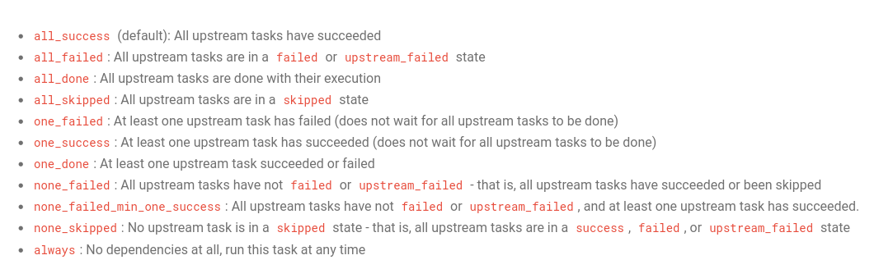
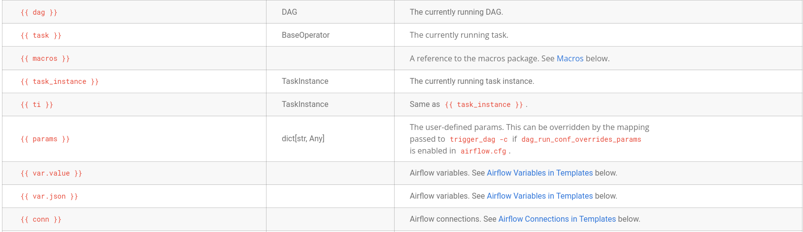
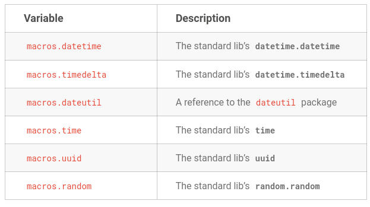
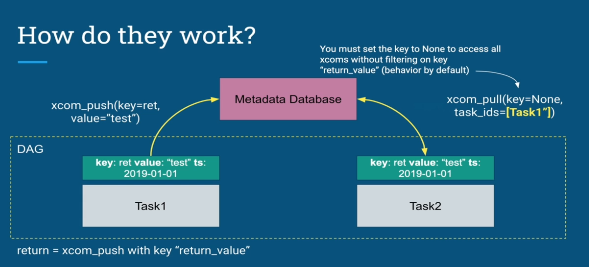
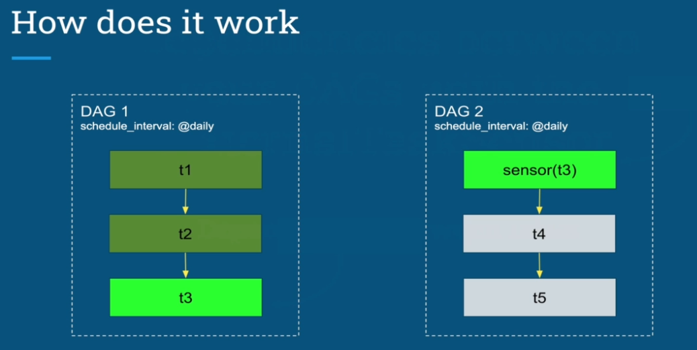

# Advanced Concepts

## Task Group
---

TaskGroups is used in order to organize/group task in the Airflow UI DAG graph view, look the example below

```python
import airflow
from airflow.models import DAG
from airflow.operators.empty import EmptyOperator
from airflow.utils.task_group import TaskGroup

DAG_NAME="task_group"

default_args = {
    'owner': 'Airflow',
    'start_date': airflow.utils.dates.days_ago(2)
}

with DAG(dag_id=DAG_NAME, default_args=default_args, schedule_interval="@once") as dag:
    
    start = EmptyOperator(
        task_id='start'
    )

    with TaskGroup(group_id="process_a") as task_group_1:
        for i in range(5):
            EmptyOperator(task_id=f'task-{(i + 1)}')

    some_other_task = EmptyOperator(
        task_id='check'
    )

    with TaskGroup(group_id="process_b") as task_group_2:
        for i in range(5):
            EmptyOperator(task_id=f'task-{(i + 1)}')

    end = EmptyOperator(
        task_id='final'
    )

    start >> task_group_1 >> some_other_task >> task_group_2 >> end
```




## Branching
---

[Branching](https://airflow.apache.org/docs/apache-airflow/stable/core-concepts/dags.html) is the mechanism allowing your DAG to choose between different paths according to the result of a specific task, in this case the `BranchPythonOperator`.

The BranchPythonOperator is much like the PythonOperator except that it expects a python_callable that returns a task (or list of task_ids). The task_id returned is followed, and all of the other paths are skipped.



> Beware! Do not have an empty path when using branching, always add a emptyTaskOperator in order to not skip required tasks, like the example below



Also it is good to notice that when using the branch operator it will be necessary to alter the `trigger_rule` of the task after the result of the branchoperator to `one_success`, otherwise the task will not execute since airflow requires all upstream task to succeed in order to execute the next task. So  in the example above the task `task_end` should have its property `trigger_rule` configured with the value `one_success`


## Trigger Rule
---

By default, Airflow will wait for all upstream task for a task to be successful before it runs that task. However it is possible to control it using the `trigger_rule` argument to a Task. Here are the currently options:



## Variables
---
Allow your dags to be idempotent, avoiding hardcode values

```bash
SELECT * FROM my_table WHERE dt="2019-01-01" # hardcode

SELECT * FROM my_table WHERE dt="{{execution_date}}" # idempotent
```

Variables can be registered by CLI or UI and are stored in the metadata database, they have three columns:
- Key
- Value
- Is encrypted

|Key|Value|IsEncrypted|
|--|--|--|
|my_settings|{ login: "hello", pass: "secret" }|Yes|

```python
custom_variables = BashOperator(
    task_id = "testing_custom_variables",
    bash_command="echo {{var.value.my_settings}}"
)
```


## Templating
---

Allows to replace placeholders by values at runtime using as example variabels, templating in airflow uses [`Jinja Templating`](https://jinja.palletsprojects.com/en/3.1.x/) and the placeholders are the symbols `{{}}`

## Macros
---

Macros are functions predefined by airflow, an extensive list of variables and macros could be found [here](https://airflow.apache.org/docs/apache-airflow/stable/templates-ref.html#macros).

Below is some useful examples





## Params
---

Params is how Airflow provides runtime configurations to task

```python
from airflow import DAG
from airflow.models.param import Param

with DAG(
    "the_dag",
    params={
        "x": Param(5, type="integer", minimum=3),
        "y": 6
    },
) as the_dag:

    PythonOperator(
    task_id="from_template",
    op_args=[
        "{{ params.x + 10 }}",
    ],
    python_callable=(
        lambda x: print(x)
    ),

    BashOperator(
        task_id="generate_new_logs",
        bash_command="echo {{params.filename}}",
        params={'filename': 'log.csv'})
)    
```

## XComs
---

XComs(short for "cross-communications") are a mechanism that let tasks talk to each other, allowing multiple tasks to exchange messages/states between them.

An XCom is identified by a `key` (essentially its name), as well as the `task_id` and `dag_id`.

It is possible to set values to xcon through 2 ways:

- calling the method `xcom_push` on task instance. Ex xcom_push(key="my-key", value="test")
- return a value in the operator

To retrieve a value use the method `xcom_pull`




> Beware! It is designed for small amounts of data, so do not use them to pass around large values, like dataframes

## Triggering another Dag
---

The operator `TriggerDagRunOperator` enables a DAG to trigger another DAG based on conditions, allowing to keep your DAGs simple.

Also it is important to keep in mind that:

- Controller does not wait for target to finish
- Controller and target are independent
- No visualisation from the controller neither history
- Both DAGs must be scheduled

##  Wait for another DAG to finish
---

The sensor `ExternalTaskSensor` enables a DAG to wait for another DAG to finish in order to proceed the execution, creating dependencies

Keep in mind that both of them should be in the same schedule_interval



Also it is important to keep in mind that:

- Keep the same schedule between your DAGs (or use execution_delta **OR** execution_date_fn parameters)
- ExternalTaskSensor is different from TriggerDagRunOperator
- Mode "poke" is used by default (use reschedule if needed)